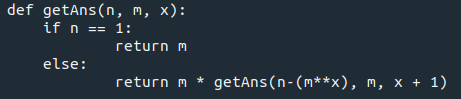
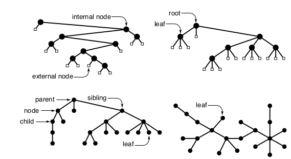

Trees

## Trees

Trees are used to describe dynamic properties of algorithms
- Explicit data structures that are concrete realizations of trees
- Most familiar application is file system
- Empty collection of vertices(nodes) connected by edges. A **path** is a list of successive **vertices** connected by **edges**.
- Disjoint set of trees is a **forest**
- Only one path connecting any two nodes, otherwise it's a **graph**.
- The convention is draw the root at the top.
- Nodes with no children are called **leaves**, **terminal** nodes.
- Trees can be **ordered** or not.
- Ordered forests can be represented as binary trees by putting childs to the left and sibilings to the right.
- **Tree-isomorphism problem** is about representing undordered trees are ordered trees. Or trees that are basically the same, just with some nodes reordered or swapped.
- **Internal nodes** are nodes with children. **External nodes** do not have children.
- The **level** of a node is one higher than the parent's.
- The **path length** of a tree is the sum of the levels of all the tree's nodes.
- The **internal path length** is the sum of the levels of all interal nodes.
- The **external path lenght** is the sum of the levels of all external nodes.
- A **degenerate tree** is a tree with only one child per leaf, thus behaves like a linked list.

### Tree properties

- A binary tree with N internal nodes has N+1 external nodes.
- A binary tree with N internal nodes has 2N links. N -1 links to internal nodes and N + 1 links to external nodes.
- The external path length of any binary tree with N internal nodes is 2N greater than the internal path lenght.
- The height of a binary tree with N internal nodes is at aleast lgN and at most N - 1.
- The internal path length of a 
binary tree with N internal nodes is at least Nlg(N/4) and at most N(N - 1)/2.

### Tree traversal

- **Preorder** where we visit the node, then the left and right subtrees.
- **Inorder** visit left subtree, then node, then right subtree.
- **Postorder** visit the left and right subtrees, then the node.
- **Level-order** visit top-down, left-right, nodes per level.

### Types

- Trees
- Rooted trees: We have a node designated as a **root**. A **free tree** is not a rooted one.
- Ordered trees or general trees
- M-ary trees and binary trees

